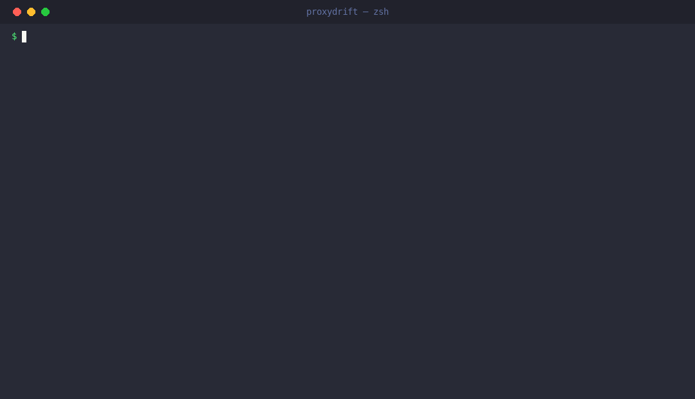

[English](./README.en.md) | **简体中文**

<div align="center">

# ProxyDrift

**你的 Agent 代理指标一路上涨，真实业务结果却在悄悄变差。**


[](https://pypi.org/project/proxydrift/)
[](https://pypi.org/project/proxydrift/)
[](./LICENSE)
[](https://github.com/SuperMarioYL/proxydrift/actions/workflows/ci.yml)
[](https://docs.astral.sh/uv/)

ProxyDrift 把 Agent 决策流与延迟到达的真实结果流做 **lag 对齐 join**，在「代理上行 + 结果下行 + 反相关」的滚动窗口立刻亮旗——像 OpenAI 监控内部 Coding Agents 那样的问题意识，但任何团队都能对自己的两条数据流跑，审计叙事可选接国产模型 GLM 与 DeepSeek。

[快速开始](#quickstart) · [演示](#demo) · [工作原理](#how) · [付费与托管版](#pricing) · [Gitee 镜像](https://gitee.com/SuperMarioYL/proxydrift)

</div>

<h2 id="why"> 为什么是这个问题 / Why this exists</h2>

你把一个业务指标交给 Agent 优化。真实结果要 7 天、 30 天后才从 CRM/留存报表里浮现，所以你交给它的是一条**可即时测量的代理指标**——互动量、点击率、工单关闭数。Agent 会精确地优化你交给它的东西：互动量确实在涨，仪表盘一片绿。问题出现在别处、也更晚：涨上来的互动是标题党和 emoji 蹭来的，真正该涨的关注转化在悄悄掉。

这层盲区是结构性的：eval 与可观测性面板打分的就是交给 Agent 的那条指标，回路里**没有任何环节在比对代理位移和下游结果位移**。等结果明显不对时，漂移往往已经复利了几周，只剩一次事后人工排查。

这不是杞人忧天——OpenAI 在[《我们如何监控内部 Coding Agents 的失配》](https://openai.com/index/how-we-monitor-internal-coding-agents-misalignment/)里确认：代理指标改善而真实结果变差的 reward hacking，是生产级 Agent 上真实存在、需要持续监控的失效类别。他们的方案是内部轨迹的 LLM 复查，不出大门；ProxyDrift 回答的是另一个问题：**「指标和结果背离了吗？」**——两条流的时间对齐 join，你自己的数据，一条命令。

>  **硬性前提**：ProxyDrift 只接受同时拥有两条流的场景——一条 proxy 决策流（Agent 日志/仪表盘可导出），加一条**可按日期 join 的延迟真实结果流**。没有结果流就没有 oracle，这类团队会自然出局——这是范围设计，不是缺陷。第一条没有自己数据的命令是 `proxydrift demo`，用内置合成回放先看机制。

<h2 id="how"> 工作原理 / How it works</h2>

核心原语是**代理—结果背离审计**：把 Agent 决策流按天聚合，结果流后移 `lag_days` 天，做日桶 join，再在滚动窗口里检测三方条件。一个窗口亮旗，当且仅当：

```
proxy_trend   > +θ      # 窗口内代理在爬（σ/天，全序列归一）
outcome_trend < −θ      # lag 对齐后的结果在沉
corr          < −0.3    # 两者反相关
```

```python
audit(proxy, outcome, lag_days=7, window=14) -> [DivergenceFlag]

DivergenceFlag {
  window: (t0, t1)             # 亮旗窗口（相邻/重叠窗口会合并）
  proxy_trend: float           # 窗口内代理斜率（σ/天）
  outcome_trend: float         # lag 对齐结果的斜率（σ/天）
  corr: float                  # 窗口内 Pearson 相关
  suspect_action_ids: [str]    # 窗口内代理质量占比最高的动作
  verdict: "correlational heuristic — not a causal verdict"   # 代码强制盖章
}
```

三条设计红线：

- **lag 对齐，绝不猜时间**。结果缺失的决策日作为覆盖率缺口列出并从 join 剔除——不插值、不前向填充；补齐数据后重跑即可。
- **每条旗标都是相关性启发式**，由代码盖章，LLM 无权更改。旗标的意思是「去查这个窗口」，不是行为不当的证明，更不是因果判决。
- **统计审计独立成立**。不设任何 API key，审计照常完成；模型只负责把已亮旗窗口写成中文叙述。

```
proxy.csv  ─┐
            ├─> streams.py ──> align.py ───> divergence.py ───> report.py ──> 终端 + report.html
outcome.csv ─┘   (严格校验)    (lag 后移,      (窗口斜率,          (双趋势图, 旗标底纹,
                                 日桶 join)     相关, 亮旗)         base64 内嵌单文件 HTML)
                                                      │
                                                      └──> llm_review.py（一次 GLM/DeepSeek 调用；无 key → 跳过）

demo_data.py ──> 内置合成回放（植入背离，确定性生成，兼作示例与测试夹具）
```

| 模块 | 职责 |
| --- | --- |
| `streams.py` | 两份 CSV 的严格加载与校验；schema 错误双语报错，精确到文件、行、列 |
| `align.py` | 结果流按 `lag_days` 后移、日桶 join；覆盖率缺口显式呈现 |
| `divergence.py` | 纯函数检测引擎：窗口趋势、相关、合并、嫌疑排序、判定盖章 |
| `report.py` | 双语终端摘要 + 自包含 HTML 报告（无外链资源，离线可看） |
| `llm_review.py` | 一次 OpenAI 兼容请求生成中文审计叙事；无 key 优雅跳过 |
| `demo_data.py` | 确定性合成创作者增长回放 |

<h2 id="install"> 安装 / Install</h2>

```bash
# 方式一：不安装，直接跑（推荐先试 demo）
uvx proxydrift demo

# 方式二：pip
pip install proxydrift

# 方式三：从源码
git clone https://github.com/SuperMarioYL/proxydrift.git
cd proxydrift
uv sync
uv run proxydrift demo
```

国内网络可用 [Gitee 镜像](https://gitee.com/SuperMarioYL/proxydrift) 克隆；PyPI 安装不受影响。

<h2 id="quickstart"> 快速开始（10 分钟） / Quickstart</h2>

**第 1 步 · 60 秒看到它工作**（无需数据、无需 key）：

```bash
uvx proxydrift demo
```

```text
ProxyDrift demo — 合成创作者增长回放 / synthetic creator-growth replay
  公众号内容 Agent 被交付「单篇互动量」作为优化目标；真实结果「7 日关注转化」要 7 天后才到达。
  Agent 逐渐把动作质量换成互动诱饵，代理指标一路上涨，延迟对齐后的转化率持续下沉。
  数据完全合成、确定性生成（seed = 20260914），仅用于演示检测机制 / fully synthetic, deterministic, for demonstrating the mechanism only.

ProxyDrift 背离审计 / divergence audit
  对齐 join        lag = 7 天/days, 已对齐决策日 joined decision days = 61
  覆盖缺口 gaps    2 天/days（结果流当日缺观测 / outcome not observed）
  扫描窗口 windows 48（window = 14 天/days）
  亮旗 flags       1

  FLAG 1  2026-07-07 → 2026-08-08（33 天/days）
    proxy 趋势 trend    +0.09 σ/day
    outcome 趋势 trend  -0.10 σ/day
    窗口相关 corr       -0.91
    嫌疑动作 suspects   title_shock, topic_pileup, emoji_bait
    判定 verdict        correlational heuristic — not a causal verdict（相关性启发式，非因果结论）
报告已写入 / report written: report.html
审计叙事 narrative: skipped — 未设置 ZHIPU_API_KEY / DEEPSEEK_API_KEY，统计审计独立成立 / no API key set; the statistical audit stands alone
HTML 报告 report: report.html
```

同目录会生成自包含的 `report.html`：双趋势图（代理爬升、lag 对齐结果下沉）、旗标窗口底纹、嫌疑动作表、覆盖率缺口表。用浏览器打开即可，`--open` 参数让它自动打开。

**第 2 步 · 看输入长什么样**：

```bash
proxydrift --show-template
```

打印两条 CSV 的契约——`proxy.csv`（`date, action_id, proxy_value`，每行动作一行）从 Agent 日志或仪表盘导出；`outcome.csv`（`date, outcome_value`，每天一行）从延迟业务指标导出。

**第 3 步 · 审计你自己的两条流**：

```bash
proxydrift audit proxy.csv outcome.csv --lag 7 \
  --proxy-label "单篇互动量" --outcome-label "7 日关注转化"
```

仓库里的 [`examples/`](./examples/) 就是同一份合成回放的落盘版本，可以直接拿来跑：

```bash
proxydrift audit examples/creator_growth_proxy.csv examples/creator_growth_outcome.csv --lag 7
```

（退出码为 1——旗标亮起，见[命令与退出码](#usage)。）

**可选 · 接国产模型写审计叙事**：设置 `ZHIPU_API_KEY`（GLM，默认 `glm-4.6`）或 `DEEPSEEK_API_KEY`（默认 `deepseek-flash`），再跑一次 audit，报告里会多一段模型生成的中文叙事块。不设 key，统计审计照常成立。

<h2 id="demo"> 演示 / Demo</h2>

`proxydrift demo` 的完整实录（终端 + `report.html`）：



回放里发生了什么：合成公众号内容 Agent 被交付「单篇互动量」，前三周主要写深度原创、互动量自然衰减；随后动作组合滑向 `title_shock` / `topic_pileup` / `emoji_bait` 三类互动诱饵——**互动量从低点约 82 涨到 317，7 日关注转化从 5.4% 掉到 2.2%**。lag 对齐 join 把两条流放到同一时间轴上，一条旗标落在 2026-07-07 → 2026-08-08（33 天，窗口相关 −0.91），嫌疑动作就是那三个诱饵。全部数据确定性合成（seed 固定），仅为演示检测机制。

<h2 id="usage"> 命令与退出码 / CLI reference</h2>

```
proxydrift [--version] [--show-template] {audit,demo}
```

**`audit PROXY_CSV OUTCOME_CSV`** — 对自有两流跑背离审计。

| 参数 | 默认 | 含义 |
| --- | --- | --- |
| `--lag` | `7` | 结果流延迟天数：决策日 t 与 t+lag 观测到的结果配对 |
| `--window` | `14` | 滚动窗口天数（按已对齐决策日滚动） |
| `--theta` | `0.05` | 趋势阈值（σ/天）：代理需 > +θ 且结果 < −θ |
| `--corr-threshold` | `-0.3` | 窗口相关系数上限 |
| `--max-suspects` | `3` | 每条旗标列出的嫌疑动作数 |
| `--report PATH` | `report.html` | HTML 报告路径 |
| `--no-report` | — | 只出终端审计，不写 HTML |
| `--no-llm` | — | 跳过审计叙事（即使已设置 key） |
| `--proxy-label` / `--outcome-label` | `proxy` / `outcome (lag-aligned)` | 报告中两条流的名称 |
| `--title` | `ProxyDrift 背离审计报告` | 报告标题 |
| `--open` | — | 写完报告后在浏览器打开 |

**`demo`** — 重放内置合成回放，参数同上（外加 `--seed`，默认固定），报告自动带上「单篇互动量 / 7 日关注转化」标签。回放未亮旗视为回归，退出码 2。

**退出码**（可在 CI 里当门禁用）：

| 码 | 含义 |
| --- | --- |
| `0` | 审计完成，未亮旗（demo：植入旗标如预期亮起） |
| `1` | 审计完成，至少一条旗标亮起 |
| `2` | 输入或参数错误（schema 不符、非法阈值、回放回归） |

<h2 id="config"> 配置 / Configuration</h2>

检测阈值全部走 CLI 参数（见上表）。模型叙事走环境变量：

| 环境变量 | 作用 |
| --- | --- |
| `ZHIPU_API_KEY` | 启用 GLM 叙事（智谱开放平台，主选；默认模型 `glm-4.6`） |
| `DEEPSEEK_API_KEY` | 启用 DeepSeek 叙事（默认 `deepseek-flash`） |
| `PROXYDRIFT_LLM_PROVIDER` | 强制 `glm` 或 `deepseek`（两把 key 都在时默认 GLM） |
| `PROXYDRIFT_GLM_MODEL` | 覆盖 GLM 模型名（GLM-4 系列内选择） |
| `PROXYDRIFT_DEEPSEEK_MODEL` | 覆盖 DeepSeek 模型名（如 `deepseek-v4-pro`） |

叙事请求为一次 OpenAI 兼容 `chat/completions` 调用，30 秒超时；请求失败按跳过处理并提示原因，**绝不影响审计本身**。模型只描述已亮旗窗口的统计形状，相关性判定标签由代码盖章。

<h2 id="compare"> 能力边界与分工 / Scope and comparison</h2>

| 问题 | 谁来回答 |
| --- | --- |
| 「交给 Agent 的这条指标涨了吗？」 | eval / 可观测性面板（本来就在做） |
| 「这个 Agent 的行为看起来失配吗？」 | OpenAI 式 LLM 轨迹复查（内部系统，不对外） |
| **「代理指标和延迟真实结果背离了吗？哪个窗口？哪些动作？」** | **ProxyDrift** |

v0.1 明确不做的（也是刻意冻结的）：

- 因果归因——旗标永远是相关性启发式，判定标签由代码盖章；
- Web UI、实时流式接入（OpenTelemetry、live agent hooks）——只做离线批 CSV；
- 评估平台导出适配器（Kiln、W&B 等）——等第二个真实从业者需求信号；
- 告警 webhook（飞书/钉钉/Slack）与定时监控——留给托管版；
- 自动修复或 reward 重调——审计工具不下处方。

<h2 id="pricing"> 付费与托管版 / Pricing</h2>

**自托管 CLI 永久免费、MIT 开源**——审计引擎、报告、demo 全部在本地跑完，数据不出你的机器。

**托管版（内测候补中）**，为不想自己搭定时任务的增长团队准备：

| | 免费自托管 CLI | 托管版（候补） |
| --- | --- | --- |
| 双流背离审计 | 手动一条命令 | 定时自动跑 |
| 告警 | 终端 + report.html | 飞书 / 钉钉 / Slack webhook |
| 报告历史 | 本地文件 | 云端留档、可回看 |
| 部署 | 你的机器 | 阿里云，可选私有部署（数据不出域） |
| 价格 | ¥0 | **¥299/月/监控回路**（席位不限）；首批 5 个创始团队 **¥199/月** |

如何进入候补：在 [GitHub Issues](https://github.com/SuperMarioYL/proxydrift/issues) 提交标题带 `hosted-beta` 的 issue（report.html 页脚也有入口）。我们会在 24 小时内联系你，用一次 30 分钟通话**现场跑你自己的两条 CSV**——如果你的数据能亮旗，创始价当场成交（支付宝/微信收款码，前 5 个团队不建任何计费系统）。

诚实的部分：托管版只在收到第二个真实从业者的自有数据回报后启动开发。候补名单本身就是需求信号——这也是我们唯一提前收费的东西。

<h2 id="roadmap"> 路线图 / Roadmap</h2>

**v0.1.0（当前）** 已交付：两流 lag 对齐 join 引擎、窗口化背离检测、双语终端审计、自包含 HTML 报告、GLM/DeepSeek 审计叙事、内置合成回放与 36 项测试、CI 与发布工作流。

**之后：刻意冻结，直到第二个从业者信号。** 下一个真实用户用自己的两条流跑出背离并回报之前，不加任何新功能——这是对「需求是否真实」的诚实测试。信号落地后优先做：

- 定时双流审计 + 飞书/钉钉告警（托管版核心）；
- 第一个评估平台导出适配器（候选：Kiln 导出格式）；
- 更多场景预设模板（客服工单关闭率 vs 事后 CSAT、电商曝光 vs 复购）。

**最好的参与方式**：[用你自己的两条数据流跑一次](https://github.com/SuperMarioYL/proxydrift/issues)，把亮了什么旗（或者没亮）回报到 issue——你的回报直接决定这个项目接下来做什么、以及要不要继续做。

<h2 id="license"> 许可 / License</h2>

[MIT](./LICENSE) © 2026 SuperMarioYL。演示数据为确定性合成，与任何真实账号无关。

---

<p align="center"><sub><a href="./LICENSE">MIT</a> © 2026 SuperMarioYL</sub></p>
